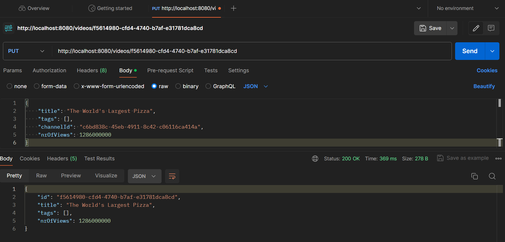

# YouTube Advertisement Recommender Web App
### 2024, Spring - Szabo Lorand

## Table of Contents
> 1. Introduction
> 2. Design 
> 3. Implementation
> 4. Testing
> 5. Demo
> 6. Future Improvements & Ideas
> 7. Bibliography

## 1. Introduction
### Objective
This is a university 'Software Design' project that focuses on the development of an app with an emphasis on backend functionality and a user-friendly interface.
### Idea
The goal of this app is to provide a platform for advertising companies in order to select appropiate YouTube channels for their ad. This recommendation is based on using the analysis of audience reach and views of videos related to specific topics matching the ad's theme.

## 2. Design
### 2.1. Use Cases

- __Actors__ and their __actions__: 
    - _Advertising Company_ - queries the potential success of their add and recommendations for successful collaborations.
    - _YouTube Observer_ - updates database upon changes in views, new videos, channels, or adds data on demand.

### 2.2. Class Diagram


In this design there are 3 classes:
- Video: must have a YTChannel and has a List of Tags that can be empty.
-  YTChannel: has a List of Videos and a List of tags, both of which can be empty.
- Tag: has a HashMap of Tag and Double values that represents how related the tag is to other tags. This relation is used to calculate the appropiate channel and tags for a certain advertisement.

The Video-YTChannel relation is slightly redundant, however, it is necessary for quicker access of related instances, which in this app is key because these are the most used operations (find Channel of a Video, find Videos of a Channel, respectively).


### 2.3. Database Diagram


Compared to the Class diagram, more tables are needed to represent the One-To-Many (_channel-video_) and Many-To-Many relationships (_tag-tag_, _channel-tag_).

# 3. Implementation
### 3.1. Backend
For the backend of the app, Java Spring framework has been used, and the following package structure is used:
- controller - used to connect API calls with service level
    - converter - converts DTOs to Entities. This is important because the app gets DTOs from API calls instead of Entities, while the Controllers require Entities.
- dto - DTOs (Data Transfer Objects) have the same parameters as the Entities, however instead of references to other objects, they have their IDs.
- entity - represents the model package of the app.
- exception
- repository - interfaces extending the JpaRepository.
- service - layer that connects the database to the app: takes data from the database and creates entity instances or takes entity instances and modifies the database.

Cascading tables to be solved...

### 3.2. Frontend
To be continued...

## 4. Testing
### 4.1. Unit Testing
To be continued...

### 4.2. Test Cases for Postman

- Reading all the Videos: GET localhost:8080/videos

- Reading all the Channels: GET localhost:8080/channels
- Reading all the Tags: GET localhost:8080/tags
- Inserting (Create) Video: POST localhost:8080/videos
- Inserting (Create) Channel: POST localhost:8080/channels
- Inserting (Create) Tag: POST localhost:8080/tags
```js
{
    "name": "Funny",
    "relatedTags": 
    {
        "330c6c69-3c43-4cbb-97ed-aec61a9dede6": 0.95,
        "f2a7fd5c-be22-4afb-b700-4fd213e42440": 0.25
    } 
}
```
- Update Video (change nr. of views): PUT localhost:8080/videos/f5614980-cfd4-4740-b7af-e31781dca8cd
    - if the ID is not found it calls the saveVideo() function that calls the POST API, so it inserts the new video


```js
{
    "title": "The World's Largest Pizza",
    "tags": [],
    "channelId": "c6bd838c-45eb-4911-8c42-c06116ca414a",
    "nrOfViews": 1286000000
}
```
- Update Channel: PUT localhost:8080/channels/{id}
- Update Tag: PUT localhost:8080/tags/{id}

- Deleting a Video by ID: DELETE localhost:8080/videos/{id}
- Deleting a Channel by ID: DELETE localhost:8080/channels/{id}
- Deleting a Tag by ID: DELETE localhost:8080/tags/{id}